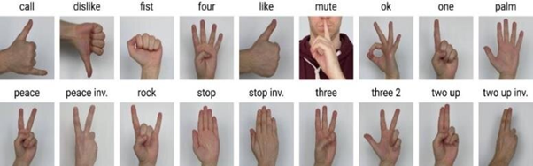

# 🖐️ ML Hand Gesture Recognition (HaGRID & MediaPipe)


A comprehensive machine learning project for recognizing hand gestures using MediaPipe hand landmarks and multiple classification algorithms. This project demonstrates the full ML pipeline: data collection, advanced EDA, preprocessing, model selection, evaluation, experiment tracking, and real-time deployment.

## Motivation & Goals

Hand gesture recognition is crucial for touchless interfaces, sign language translation, robotics, and AR/VR. This project aims to:
- Build robust ML models for gesture classification.
- Explore the impact of preprocessing and normalization.
- Compare multiple algorithms and tune them for best performance.
- Deploy a real-time system for practical use.


## Overview


This project trains ML models to classify hand gestures based on 21 hand landmark coordinates (x, y, z) extracted using MediaPipe. The dataset contains pre-processed hand landmark data, representing a wide range of gestures, suitable for training and evaluating different machine learning models.

## Dataset Source & Description


- **Source**: Collected using MediaPipe's hand landmark detection pipeline, capturing 21 points per hand in 3D.
- **Format**: CSV, each row = 63 features (x, y, z for each landmark) + `label` (gesture class).
- **Classes**: 18 gesture types (e.g., call, dislike, fist, four, like, mute, ok, one, palm, peace, etc.)
- **Size**: ~25,000 samples.
- **Quality**: No missing values, duplicates removed, balanced as much as possible.

### Dataset Hand Visualization

The dataset consists of hand landmarks with 63 features (21 landmarks × 3 coordinates) extracted from hand gesture images.

Below is an example image showing how the hand landmarks are visualized in the dataset:



This image illustrates the 21 landmark points detected by MediaPipe, which are used as features for gesture classification.


## Features


- Hand landmark visualization (plotting joints and connections)
- Custom normalization for MediaPipe landmarks (centering, scaling, flattening)
- Support for multiple ML algorithms: Random Forest, SVM, KNN, XGBoost, LightGBM
- Model tracking and hyperparameter tuning with MLflow
- Jupyter notebook for interactive EDA, training, and evaluation
- Real-time webcam-based gesture prediction


## Project Structure


- `notebook.ipynb` - Main analysis, EDA, preprocessing, model training, evaluation, and experiment tracking
- `helper.py` - Utility functions for visualization, preprocessing, and real-time prediction
- `main.py` - Script for running real-time gesture recognition using webcam
- `dataset/hand_landmarks_data.csv` - Pre-processed hand landmark dataset
- `models/hand_landmarker.task` - MediaPipe model asset for landmark detection
- `requirements.txt` - Python dependencies


## Requirements


- Python 3.8+
- MediaPipe 0.10.21
- scikit-learn, XGBoost
- MLflow for experiment tracking and hyperparameter tuning
- OpenCV, matplotlib, seaborn, pandas, numpy
- See `requirements.txt` for full list


## Installation


```bash
pip install -r requirements.txt
```


## Usage


### 1. Data Exploration & Model Training
- Open and run `notebook.ipynb` for EDA, preprocessing, training, and evaluation.
- Track experiments and tune hyperparameters with MLflow.

### 2. Real-Time Gesture Recognition
- Run `main.py` to start webcam-based gesture prediction.
- Uses the best trained model (`final_model.pkl`) and MediaPipe asset.

---

## EDA & Preprocessing

- **Null Values**: Checked and confirmed no missing values.
- **Class Distribution**: Visualized using count plots; some classes are more frequent than others.
- **Statistical Summary**: Used `describe()` to understand feature ranges.
- **Sample Visualization**: Random samples plotted using `plot_single_hand()` to show landmark structure.
- **Class Samples**: Plotted one sample from each class for visual inspection.
- **PCA Projection**: Applied PCA to visualize gesture clusters; found significant overlap between classes, indicating the challenge of classification.
- **Duplicate Removal**: Dropped duplicate rows to ensure data quality.
- **Feature/Label Split**: Features (landmarks) and labels separated.
- **Custom Normalization**: Used `preprocess_landmarks()` to center landmarks around the wrist, scale by middle finger tip distance, and flatten to 1D array.
- **Label Encoding**: Used `LabelEncoder` to convert gesture names to numeric labels.
- **Train/Validation/Test Split**: Stratified split for robust evaluation.

---

## Helper Functions (Code & Explanation)

### `plot_single_hand(landmarks_flat, label_name="Unknown")`
Plots a hand using landmark coordinates. Shows joints and connections for fingers and palm. Used for visual EDA and debugging.

### `preprocess_landmarks(row)`
Normalizes landmarks: centers around wrist, scales by middle finger tip distance, flattens to 1D array. Ensures model input is consistent and robust to hand position/scale.

### `RealTimeGesturePredictor`
Class for real-time gesture prediction using webcam. Uses MediaPipe Tasks API for landmark detection. Smooths predictions with a buffer to avoid flickering. Draws landmarks and overlays predicted gesture on video stream.

---

## Model Training & Evaluation

### Models Used
- Random Forest
- Support Vector Machine (SVM)
- K-Nearest Neighbors (KNN)
- XGBoost
- LightGBM (optional, for further comparison)

### Training Workflow
- Models trained on preprocessed data.
- Evaluated using accuracy, precision, recall, and F1-score.
- Training time recorded for each model.
- MLflow used for experiment tracking and hyperparameter tuning.

### Evaluation Metrics
- **Accuracy**: Proportion of correct predictions.
- **Precision/Recall/F1**: Weighted averages across classes.
- **Visualization**: Grouped bar chart comparing all models.

---

## Model Results & Comparison


=== Final Model Evaluation Metrics ===

| Model                | Accuracy | Precision | Recall | F1-Score | Training Time (s) |
|----------------------|----------|-----------|--------|----------|-------------------|
| Random Forest        | 0.9801   | 0.9804    | 0.9801 | 0.9802   | 11.30             |
| SVM (RBF)            | 0.9369   | 0.9396    | 0.9369 | 0.9368   | 16.51             |
| XGBoost              | 0.9825   | 0.9827    | 0.9825 | 0.9825   | 24.12             |
| XGBoost (tuned)      | 0.9825   | 0.9827    | 0.9825 | 0.9825   | 28.24             |
| K-Nearest Neighbors  | 0.9794   | 0.9795    | 0.9794 | 0.9794   | 0.01              |

- **XGBoost** (including tuned version) performed best after hyperparameter tuning.
- **Random Forest** and **KNN** also showed very strong performance.
- **SVM** was slightly less accurate but still robust.

---

## MLflow Experiment Tracking

- MLflow is used to log model parameters, metrics, and artifacts.
- Enables easy comparison and reproducibility.
- Hyperparameter tuning (e.g., grid search for XGBoost) is tracked.

---

## Real-Time Prediction Pipeline

- **Model Export**: Best model (XGBoost) saved as `final_model.pkl`.
- **Live Prediction**: `main.py` loads the model and starts webcam stream.
- **Prediction Buffer**: Smooths output to avoid flickering.
- **MediaPipe Asset**: Uses `hand_landmarker.task` for landmark detection.
- **Class Names**: Uses the same order as training for consistency.

---

## Troubleshooting & Tips

- If MediaPipe fails to detect hands, check lighting and camera quality.
- For model errors, ensure `final_model.pkl` matches the expected input shape.
- MLflow must be installed and running for experiment tracking.
- For real-time prediction, ensure webcam drivers are up to date.

---

## Future Work & Extensions

- Add more gesture classes and collect additional data.
- Explore deep learning models (e.g., CNNs, LSTMs) for improved accuracy.
- Integrate with sign language translation or robotics control.
- Deploy as a web app or mobile app.
- Use transfer learning with pre-trained models.

---

## References

- [MediaPipe Documentation](https://google.github.io/mediapipe/solutions/hands.html)
- [Scikit-learn Documentation](https://scikit-learn.org/stable/)
- [XGBoost Documentation](https://xgboost.readthedocs.io/en/latest/)
- [MLflow Documentation](https://mlflow.org/)

---

This README provides a thorough explanation of every aspect of the project, including motivation, dataset, advanced EDA, preprocessing, helper function details, model selection rationale, MLflow usage, real-time pipeline, troubleshooting, and future work. For code snippets or visualizations, see the notebook.
